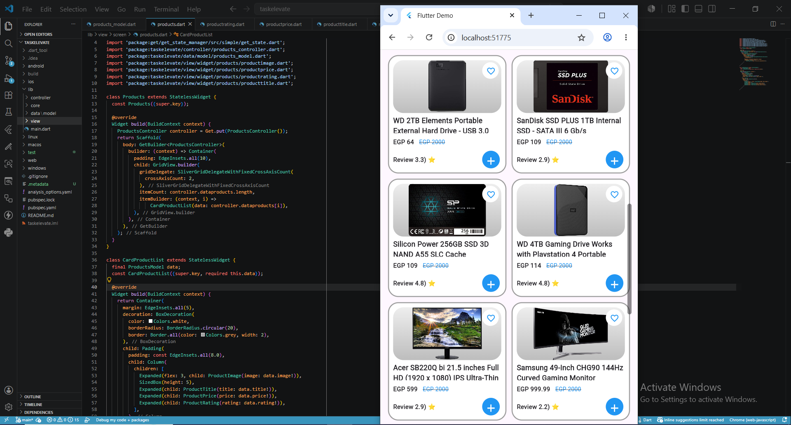

# Flutter Products App 🛍️

A simple Flutter application that fetches products from a REST API and displays them in a clean and responsive grid UI.

## 📱 Project Overview

This project was built as part of a Flutter task.  
It demonstrates fetching data from an external API and displaying it using a structured UI with reusable widgets.

The app uses the following API:
https://fakestoreapi.com/products

---

## ✨ Features

- Fetch products from REST API
- Display products in Grid View
- Product image, title, price, and rating
- Clean and reusable UI components
- GetX state management
- Responsive product cards UI

 ## 📸 Screenshots

